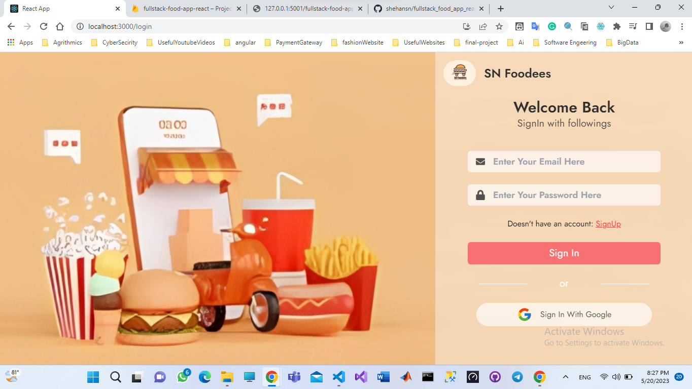

> fullstack food delivery application using react js , tailwind css
> [follow me on](https://www.youtube.com/channel/UCjSIqXGLjd5VqsfAl0r-J6Q)



# To check the node version

```
node --version
```

# To Initilize Firebase Console

```
firebase init
```

# To start the client

```
yarn start
```

# To start the server

```
npm run dev
```

# Add service account key

```
add service account key inside to server
```

# Add Envirenment variables

```
add envirenment variables to both client and server folders
```

# To create react project using npm or yarn

```
npx create-react-app folder-name

yarn create react-app folder-name

```

# Or To create react project using yarn

```
yarn global add create-react-app
create-react-app folder-name
```

# To create server

```
npm init

```
